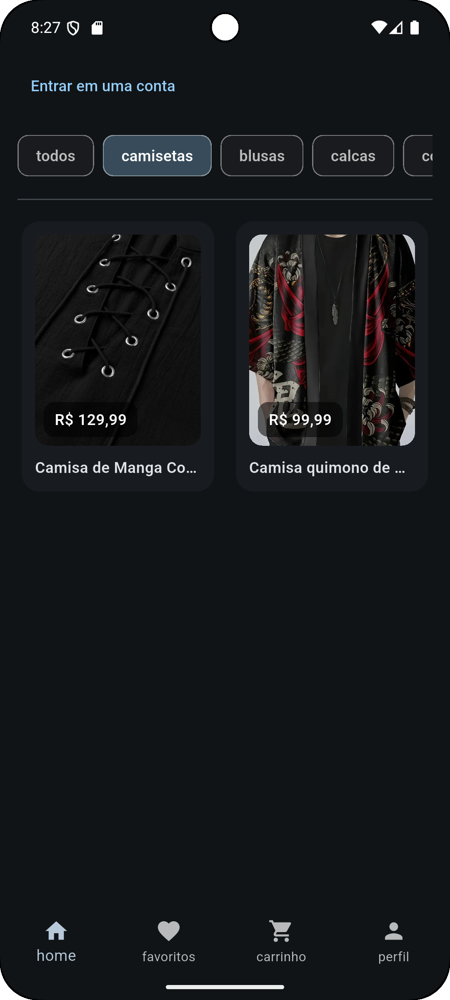
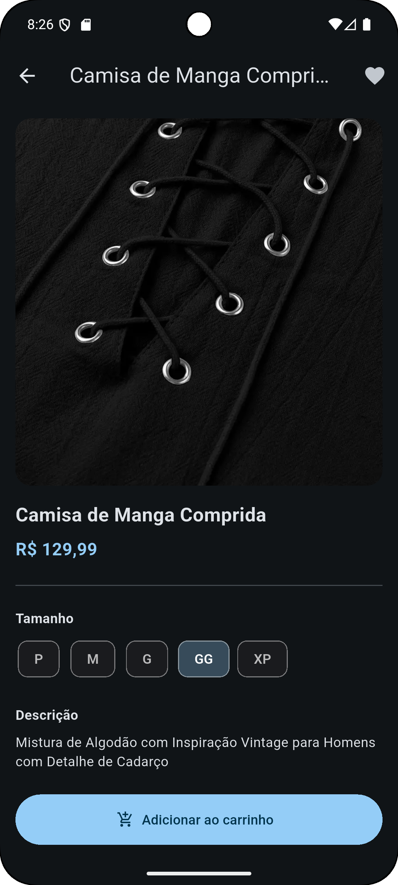
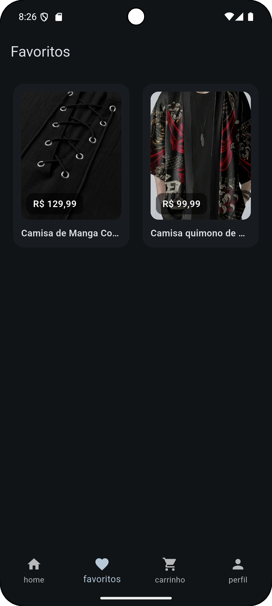
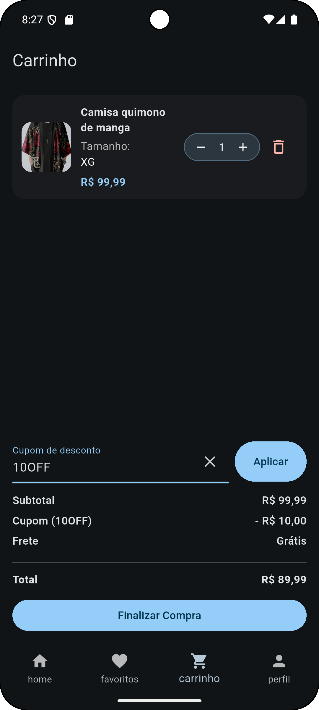
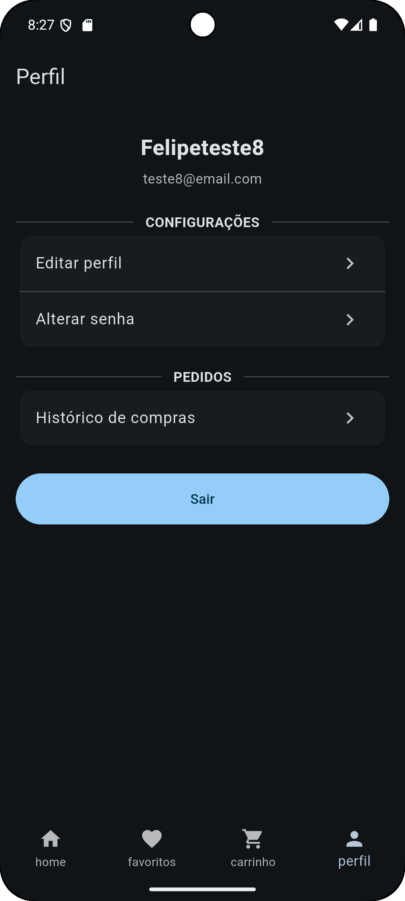

# Delta E-commerce (Flutter + Firebase)

App de e-commerce com Home, Favoritos, Carrinho (cupom), Detalhe do produto, Perfil (login, editar dados, alterar senha), Histórico de compras.

## Stack
- Flutter (Material 3, dark theme)
- Firebase Auth, Firestore

## Screens
Home · Product Detail · Favorites · Cart (cupom) · Profile · Orders

## Rodando o projeto
1. Flutter {versão usada}
2. Adicionar credenciais Firebase:
    - Android: `android/app/google-services.json`
    - iOS: `ios/Runner/GoogleService-Info.plist`
    - (Web) copie `lib/firebase_options_example.dart` → `lib/firebase_options_local.dart` e preencha.
3. `flutter pub get`
4. `flutter run`

> Firestore em **modo teste**: ajuste suas regras antes de publicar em produção.

## Estrutura do Firestore (exemplo)
- `Products/{categoria}/items/{pid}` → { title, description, price, images[], sizes[] }
- `users/{uid}/favorites/{categoria_pid}` → { category, pid }
- `users/{uid}/cart/{categoria_pid_size}` → { category, pid, size, qty, addedAt }
- `orders/{orderId}` → { clientId, products[], productsPrice, couponCode, discountPercent, discountValue, totalPrice, status, createdAt }
- `coupons/{CODE}` → { percent: 10 }

## Licença
MIT
